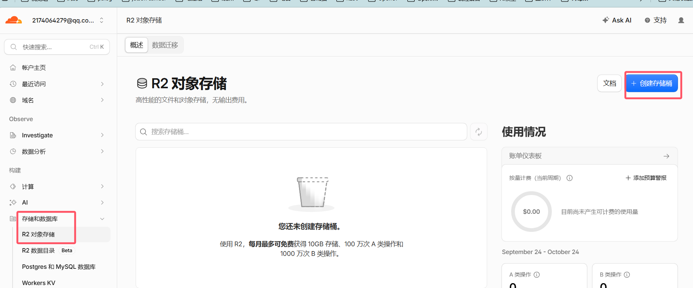
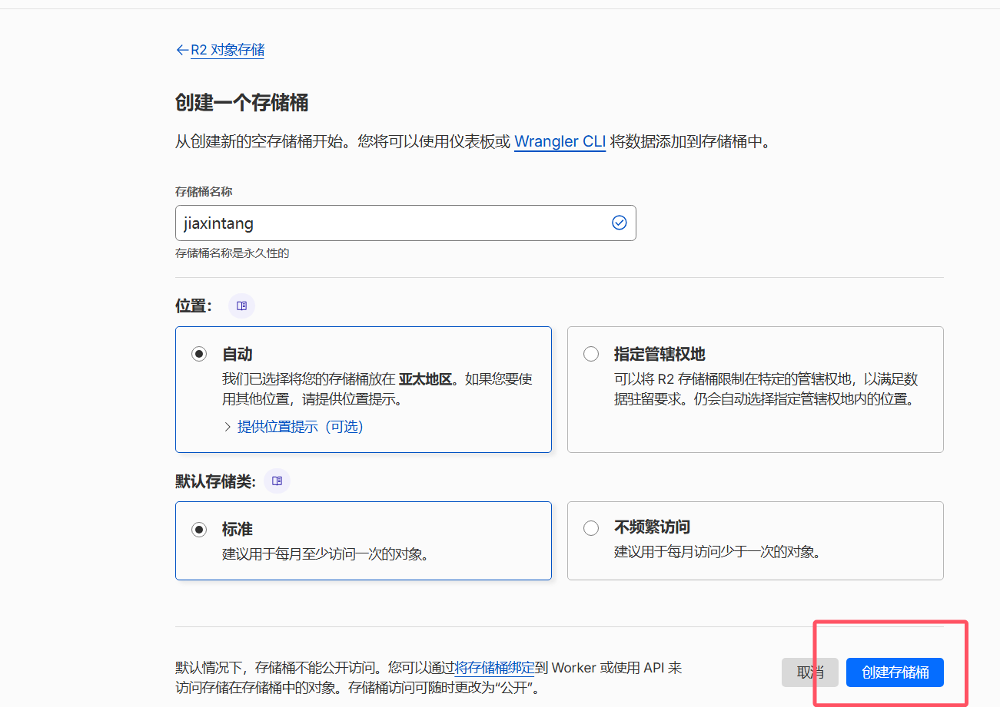
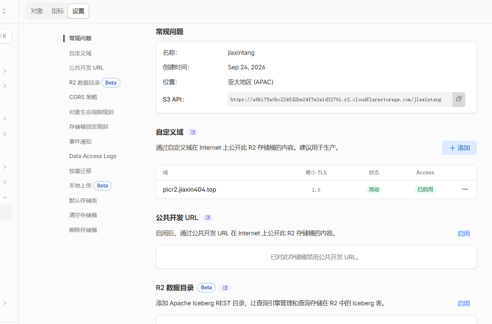
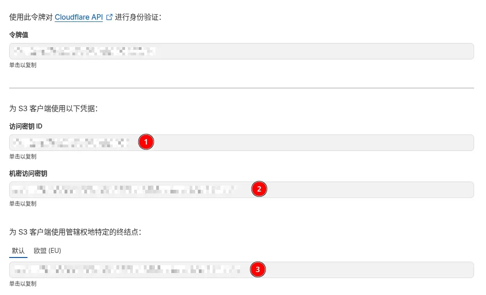
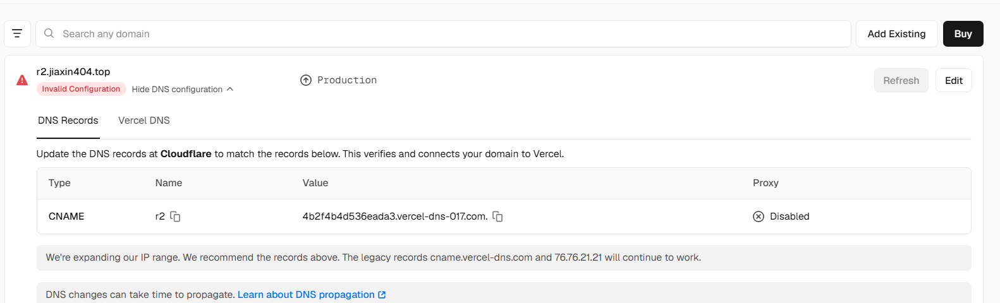

## 前言

随着博客文章越来越多，图片也逐渐成了一个需要单独解决的问题。最开始直接把图片放在博客仓库里确实方便，但时间久了，仓库体积会越来越大；如果使用 GitHub Raw 或第三方免费图床，又可能遇到国内访问速度、服务稳定性和隐私方面的问题。自己购买服务器当然也可以，不过还要考虑存储空间、带宽费用和后续维护。

图床是一个非常必须的内容，因此，这次我选择使用 [Cloudflare R2](https://developers.cloudflare.com/r2/) 搭建自己的图床。R2 是 Cloudflare 提供的对象存储服务，兼容 S3 API，提供一定的免费额度，也可以绑定自己的域名，但是要绑定一张 Visa 卡才能使用。图片原文件存放在 R2 中，再通过一个部署在 [Vercel](https://vercel.com/) 上的管理后台完成上传、压缩、复制链接和删除等操作，非常方便。


## 一、整体方案

整个图床由四部分组成：

```text
Cloudflare R2     → 保存图片原文件
图床管理项目       → 上传、压缩和管理图片
Vercel            → 部署图床管理后台
自定义域名         → 分别访问后台和图片文件
```

图片接入博客后的实际流程是：

```text
本地选择图片
    ↓
通过 r2.jiaxin404.top 上传
    ↓
原图保存在 Cloudflare R2
    ↓
文章填写 picr2.jiaxin404.top 图片地址
    ↓
Astro 构建时下载并优化图片
    ↓
博客页面最终加载 /_astro/*.webp
```

这样做的好处是 R2 中始终保存原图，而博客发布时仍然可以使用 Astro 的图片优化。页面上看到的图片地址可能是 `https://jiaxin404.top/_astro/xxx.webp`，这是 Astro 生成的优化副本，并不是图片没有使用 R2。


## 项目

 Github 上有不少的使用 CF 的 R2 搭建图床的项目，用于我是看[axi的教程](https://axi404.top/blog/r2-image-host)简洁可控,由于时间比较紧，就直接fork下来，先部署完成，后续有时间再在基础上优化。

| ------ | ------ | ------ |
| 我的项目仓库 | [JiaXinTang-xiang/jiaxin_picr2](https://github.com/JiaXinTang-xiang/jiaxin_picr2) | 对原作者图床进行vibecoding修改和完善 |
| 源作者r2参考项目 | [Axi404/astro-r2](https://github.com/Axi404/astro-r2) | 感谢源作者的开源 |


## 二、创建 Cloudflare R2 存储桶

本身项目就是一个单纯的前端的网页，但要设置一些环境变量。
首先登录 [Cloudflare Dashboard](https://dash.cloudflare.com/)，进入 **R2 Object Storage**，按照页面提示开通 R2。具体免费额度和计费规则可能发生变化，可以查看 [R2 Pricing](https://developers.cloudflare.com/r2/pricing/)。

进入 R2 后新建一个存储桶，存储桶名称会作为后面的 `R2_BUCKET_NAME`，创建后不要随意修改。



### 绑定图片访问域名

进入存储桶的 **Settings / 设置**，找到 **Custom Domains / 自定义域**，添加：





## 三、## 准备环境变量
在 Cloudflare R2 页面进入 **Manage R2 API Tokens**，创建一个具有对象读取和写入权限的 Token。为了减少权限范围，建议只允许它访问这一个存储桶，图床后台需要通过 S3 兼容 API 上传和管理文件，因此还要创建一组 R2 API 凭据。需要创建一个 用户API令牌。之后创建的权限可以选择管理员读和写。

创建完成后会得到：




分别是 R2_ACCESS_KEY_ID, R2_SECRET_ACCESS_KEY, R2_ENDPOINT，至此全部东西都齐全

如果使用本教程中的管理网页，通常需要在 Vercel 中配置：
```text
R2_ACCOUNT_ID=你的Cloudflare账号ID
R2_ACCESS_KEY_ID=你的Access Key ID
R2_SECRET_ACCESS_KEY=你的Secret Access Key
R2_BUCKET_NAME=my-image-host
R2_ENDPOINT=<https://你的ACCOUNT_ID.r2.cloudflarestorage.com>
R2_PUBLIC_URL=<https://img.example.com>
```

## 四、准备图床管理项目

本次图床后台参考了 [Axi404/astro-r2](https://github.com/Axi404/astro-r2)，并在此基础上调整了界面、登录保护、上传方式和图片命名等功能。当前项目使用 React Router，通过 Vercel 运行服务端接口，再使用 R2 的 S3 API 操作存储桶。

项目代码保存在：
[https://github.com/JiaXinTang-xiang/jiaxin_picr2](https://github.com/JiaXinTang-xiang/jiaxin_picr2)


## 五、部署到 Vercel

登录 [Vercel](https://vercel.com/)，选择 **Add New → Project**，导入刚才创建的 GitHub 仓库。

本项目已经配置了 React Router 的 Vercel 适配，Framework Preset 保持自动识别即可，Root Directory 使用仓库根目录 `./`。

部署前需要在 Vercel 项目的 **Settings → Environment Variables** 中填写之前的变量：

| 环境变量 | 用途 |
|----------|------|
| `R2_ACCESS_KEY_ID` | R2 API Token 的 Access Key ID |
| `R2_SECRET_ACCESS_KEY` | R2 API Token 的 Secret Access Key |
| `R2_BUCKET_NAME` | R2 存储桶名称 |
| `R2_ENDPOINT` | R2 的 S3 API Endpoint，不是图片访问域名 |
| `R2_PUBLIC_URL` | 图片公开访问域名，用于生成外链 |
| `ADMIN_PASSWORD` | 图床后台登录密码，同时用于保护登录会话 |

`R2_ENDPOINT` 和 `R2_PUBLIC_URL` 很容易混淆：Endpoint 是后台调用 API 使用的地址；Public URL 才是文章中引用图片的地址。

环境变量添加完成后重新部署。部署成功后访问 Vercel 提供的 `.vercel.app` 地址，进入 `/login`，使用 `ADMIN_PASSWORD` 登录。如果修改了环境变量，也需要重新部署才会生效。


## 六、给管理后台绑定子域名（可选）

Vercel 部署完成后会分配一个 `.vercel.app` 地址，但日常使用自定义域名更容易记。本次给管理后台使用：

添加 `r2.jiaxin404.top`。随后 Vercel 会显示需要配置的 DNS 记录，目标可能是通用的 `cname.vercel-dns.com`，也可能是 Vercel 为项目给出的专用 `*.vercel-dns-xxx.com` 地址，应以项目域名页面显示的值为准。


然后进入 Cloudflare 的 **DNS → Records**，添加：

| 字段 | 内容 |
|------|------|
| Type | `CNAME` |
| Name | `r2` |
| Target | Vercel 域名页面要求的 CNAME 目标 |
| Proxy status | `DNS only`，灰色云朵 |

这里不要开启 Cloudflare 橙色云代理。开启后 Vercel 会显示 **Proxy Detected**，可能影响 Vercel 的域名验证、DDoS 防护和性能优化。保持灰色云后，等待 DNS 生效和 Vercel 签发 HTTPS 证书即可。

至此，两个子域名的职责就很清楚了：

```text
r2.jiaxin404.top     → Vercel 图床管理后台
picr2.jiaxin404.top  → Cloudflare R2 图片文件
```

## 七、接入 Astro 博客

### 允许 Astro 读取 R2 图片

为了让 Astro 在构建时处理远程图片，需要在 `astro.config.ts` 中允许图片域名：

```typescript
image: {
  domains: ['picr2.jiaxin404.top'],
  remotePatterns: [
    {
      protocol: 'https',
      hostname: 'picr2.jiaxin404.top'
    }
  ]
}
```
### 文章封面

远程封面在 Frontmatter 中这样填写：

```yaml
heroImage: {
  src: 'https://picr2.jiaxin404.top/posts/tech/tools/article-slug/article-slug-cover.webp',
  color: '#24292e',
  inferSize: true
}
```
其中 `inferSize: true` 用于让 Astro 获取远程图片尺寸。如果漏掉，远程图片可能无法通过内容校验或构建。

## 八、新增文章的固定流程

以后给新文章添加图片，只需要按照下面的步骤：

1. 使用语义名称整理图片，例如 `article-cover.jpg`、`install-settings.png`；
2. 在 [图床后台](https://r2.jiaxin404.top/) 中创建对应的文章目录；
3. 上传 JPG/PNG 时开启 WebP 压缩，质量设置为 `80%～82%`；
4. 复制 `https://picr2.jiaxin404.top/...` 图片链接；
5. 封面写入 `heroImage`，并添加 `inferSize: true`；
6. 正文使用标准 Markdown 图片语法；
7. 本地运行 `bun run build` 检查图片是否可以正常下载和优化；
8. 提交并推送博客代码，等待网站重新部署。

## 小结

至此，R2 图床图床已经可以正常使用了。


