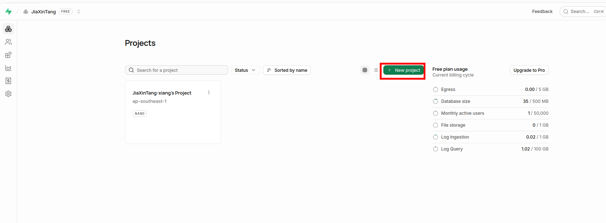
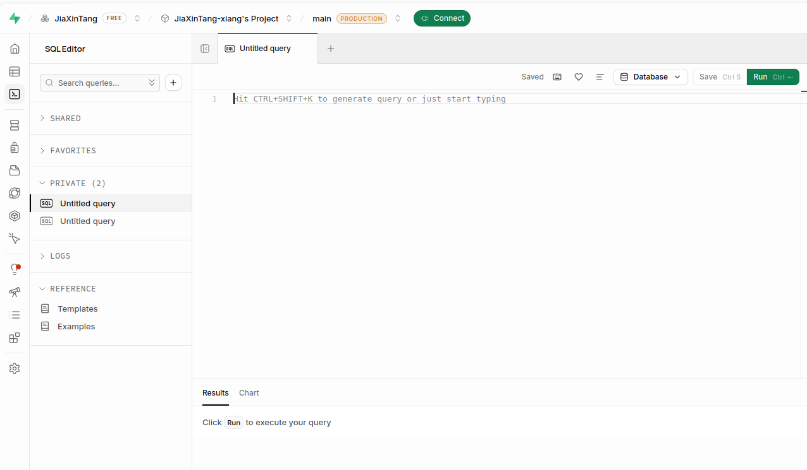

## 前言

最近在朋友的影响下，做了一个面向手机使用的 CET-4 背词应用。最初的想法很简单：把四级单词分成 45 天，每天打开做一组练习单词。

但真正开始使用后，需求很快就不再是“做一个能答题的网页”了。我希望它既能在浏览器里直接打开，也能安装成 Android App；既允许游客立即使用，也能在登录后跨设备同步；还要有每日文章、错词本、真实英语发音、敲单词模式和适合手机操作的导航。后续还可以继续加入更多词书和学习模块。

下面记录这次搭建的总体过程。

项目地址：
- 在线网站：[https://en-app.jiaxin404.top/](https://en-app.jiaxin404.top/)
- GitHub：[JiaXinTang-xiang/English-APP](https://github.com/JiaXinTang-xiang/English-APP)


## 一、为什么选择 Vue

项目最初只是一个用 JavaScript 编写的单页练习页面。随着词书、文章、音频、登录和学习记录不断增加，页面代码逐渐变长，数据处理、界面更新和事件监听也开始混在一起，后续修改会越来越困难。

Vue 提供了一套清晰的组织方式：把页面、组件、状态、路由和服务拆开管理。当前项目的主要分层如下：

- 页面放在 `src/views/`；
- 公共外壳放在 `src/layouts/`；
- 可复用界面放在 `src/components/`；
- 音频、存储和云同步放在 `src/services/`；
- 学习进度与训练状态放在 `src/stores/learning.js`；
- 路由集中放在 `src/router/index.js`。

这样增加新词书、新训练模式或新的统计页面时，可以在现有结构上继续扩展，而不需要把所有逻辑重新写进一个文件。

## 二、什么是 Vue

Vue 是一套用于构建用户界面的渐进式 JavaScript 框架。它可以从一个小组件开始使用，也可以逐步扩展为包含路由、状态管理、接口请求和原生 App 的完整应用。它的核心是“数据驱动视图”：开发者维护数据和状态，Vue 负责在数据变化后更新对应的界面。与传统开发中频繁手动查询和修改 DOM 相比，这种方式更适合学习进度、答题状态、音频设置等会持续变化的页面。

本项目使用 Vue 3 和 Composition API。Composition API 可以把同一类逻辑集中在一起，例如将训练状态、音频控制和账号同步分别封装，方便复用和测试。Vue 2.7 也提供了部分 Composition API 能力，但它仍然属于 Vue 2，不能与 Vue 3 的运行时和生态完全等同。

### Vue 的几个特点

#### 易用

Vue 建立在 HTML、CSS 和 JavaScript 之上，模板语法接近普通 HTML，因此可以从一个组件逐步开始学习。它吸收了早期前端框架中关于数据绑定和组件化的经验，同时保留了自己的响应式系统、单文件组件和清晰的模板语法。

#### 灵活

Vue 的核心保持轻量，路由、状态管理、构建工具和原生能力可以按项目需要逐步加入。小型页面可以只使用 Vue，复杂应用则可以组合 Vue Router、Vite、Capacitor 和 Supabase。

#### 性能

Vue 使用响应式更新，只重新渲染发生变化的组件，而不是每次操作都刷新整个页面。Vue 3 还通过更轻量的运行时、编译优化和按需加载减少了初始资源体积。

#### 组件化

Vue 单文件组件可以把模板、样式和交互逻辑放在同一个组件中，同时保持组件之间的边界。例如 `StudyToolbar.vue` 负责训练控制栏，`ArticleAudioPlayer.vue` 负责文章播放，`AudioSettingsDrawer.vue` 负责声音设置。组件化让这些功能既能在不同页面复用，也能独立调整，不会牵连整个应用。


## 三、技术路线与整体架构

开始开发前，我收集阅读了一组关于 Vue、Vue Router、Capacitor、Android 构建、Preferences、Supabase 和 Vercel 的资料，了解功能和作用，如下。

| 分类 | 内容 | 在本项目中的用途 |
|------|------------|------------------|
| Vue 3 | 组件、响应式状态、页面拆分 | 把大页面拆成首页、学习、文章和个人中心 |
| Vue Router | 路由、Hash History、页面导航 | 让不同功能拥有独立页面，并兼容静态部署和 Android WebView |
| Capacitor | Web 项目接入原生 Android | 复用 Vue 页面生成 APK |
| Preferences | Android 端持久化数据 | 保存游客进度和音频设置 |
| Supabase | Auth、PostgreSQL、RLS | 邮箱验证码登录、用户数据隔离和多设备同步 |
| Vercel | GitHub 自动构建和环境变量 | 部署网页版本 |
| Cloudflare | DNS 和自定义域名 | 将独立域名指向 Vercel |

因此，最终采用的技术组合是 Vue 3 + Vite + Capacitor Android，并使用 Supabase 保存账号数据、Vercel 部署网页版本。这一步确认整体架构：前端、数据库、网页部署和 Android 打包一起，可以围绕同一份 Vue 代码组合起来。

## 四、用 Vue Router 重建应用框架

重构后的应用拆成了多个独立 View,可见：

```text
src/
├── layouts/
│   └── AppShell.vue
├── router/
│   └── index.js
├── components/
│   ├── ArticleAudioPlayer.vue
│   ├── AudioSettingsDrawer.vue
│   └── StudyToolbar.vue
├── services/
│   ├── articleAudio.js
│   ├── audio.js
│   ├── books.js
│   ├── cloudSync.js
│   ├── identity.js
│   ├── storage.js
│   └── supabase.js
├── stores/
│   └── learning.js
└── views/
    ├── HomeView.vue
    ├── WordsView.vue
    ├── ArticlesView.vue
    ├── SetupView.vue
    ├── QuizView.vue
    ├── WrongBookView.vue
    ├── StatisticsView.vue
    ├── AccountView.vue
    └── AuthView.vue
```

其中，`StudyToolbar.vue` 负责电脑端顶部控制台和手机端的词书、章节、开始三项顶部栏；`AudioSettingsDrawer.vue` 集中管理发音、音标、语速、键盘音和反馈音；`ArticleAudioPlayer.vue` 与 `articleAudio.js` 单独管理文章朗读，单词真实音频使用独立的 HTML Audio，浏览器语音兜底则会避让正在播放的文章。

路由使用 `createWebHashHistory()`。地址中会出现 `#`，视觉上不如普通 History 路由干净，但它对 Vercel 静态页面、PWA 和 Capacitor WebView 更稳，不需要为每个页面额外配置服务器回退规则。

## 五、本地存储与学习状态

学习进度集中在 `src/stores/learning.js`，包括单词答题记录、章节完成情况、复习计划、错词权重和本轮训练统计。`src/services/storage.js` 对存储方式做统一封装：网页端使用 `localStorage`，Android 端使用 Capacitor Preferences。这样同一套学习逻辑可以同时运行在浏览器和 Android App 中。

## 六、搭建 Supabase 数据库

### 为什么选择 Supabase Cloud

[Supabase](https://supabase.com/) 是一个开源的后端即服务（BaaS）平台，基于 PostgreSQL 数据库构建，提供数据库、认证、存储、实时订阅和无服务器函数等服务。当前项目需要登录、数据库和多设备同步，但暂时不想维护自己的后端服务器，因此选择 Supabase Cloud。

Supabase Cloud 已经提供：

- 邮箱验证码登录；
- PostgreSQL 数据库；
- JavaScript SDK；
- Row Level Security；
- 可直接供网页调用的 API。

如果自建 Supabase，仍然需要一台长期在线、有公网访问能力的服务器，还要处理升级、备份、HTTPS 和安全问题。对当前阶段来说，Vercel 部署前端、Supabase Cloud 提供后端服务已经够用了。

### 1. 创建项目

1. 打开 Supabase 控制台，创建项目。


2. 进入 SQL Editor。
把 [schema.sql]的内容复制进去执行，然后run


3. 在 Supabase Dashboard 创建 Cloud 项目，区域选择离主要用户较近的新加坡。创建完成后，在 API 设置中获取：

- Project URL；
- Publishable key，也就是可以在启用 RLS 后用于浏览器的公开密钥。

前端通过环境变量读取配置：

```env
VITE_SUPABASE_URL=https://your-project-ref.supabase.co
VITE_SUPABASE_ANON_KEY=your-publishable-key
```

这里不能把 `secret` 或 `service_role` 密钥放进网页环境变量。所有以 `VITE_` 开头的值都会进入前端构建产物，用户能够查看，因此只能使用 Publishable/Anon key，并依靠 RLS 保护数据库。

### 2. 建立数据表

当前使用四张主要表：

| 表名 | 用途 |
|------|------|
| `profiles` | 用户资料、显示名称、昵称和性别 |
| `word_progress` | 每个单词的正确、错误和错词状态 |
| `day_progress` | 每天的完成时间和复习节点 |
| `user_settings` | 发音、自动播放和键盘音效等设置 |

`word_progress` 使用 `user_id + level + word` 作为联合主键。这样既能区分用户，也提前为 CET-6 等其他词书保留了 `level` 字段。

目前词书目录包含 CET-4 和 CET-6：CET-4 保留 45 天词汇和每日文章，CET-6 使用 2345 个词，按 50 词左右分成 47 章。两套词书的学习进度、错词本和统计分别保存，不会互相覆盖。

个人资料由 `profiles` 表保存。显示名称、昵称和性别在登录账号后同步到云端；游客模式只保存在当前设备。已有 Supabase 项目需要执行 `supabase/profile-migration.sql` 补充资料字段，音频偏好字段则由 `supabase/audio-settings-migration.sql` 补充。

### 3. 启用 RLS

只使用公开 key 并不代表数据库可以公开读写。真正的数据隔离来自 Row Level Security。每张用户表都启用了 RLS，并限制用户只能访问 `auth.uid()` 与自己 ID 相同的记录。

策略的核心形式如下：

```sql
create policy "word progress own rows"
on public.word_progress
for all
using (auth.uid() = user_id)
with check (auth.uid() = user_id);
```

## 七、部署到 Vercel 与绑定域名

之前文档有过类似的教程这里不再重复。网页版本部署在 [Vercel](https://vercel.com/)，域名由 Cloudflare 管理。完整流程为：

1. 将项目推送到 GitHub；
2. 在 Vercel 中导入仓库；
3. 设置构建命令和输出目录；
4. 添加 Supabase 环境变量；
5. 触发部署；
6. 在 Cloudflare 中配置 DNS；
7. 将 `en-app.jiaxin404.top` 绑定到 Vercel 项目。

## 八、PWA 与 Android APK

网页端保留了 PWA 能力，包括 manifest、应用图标、Service Worker、安装状态检测和“安装到手机”按钮。支持的 Android 浏览器可以把网页添加到桌面，以接近原生 App 的方式打开。

与此同时，项目还通过 Capacitor 生成真正的 Android 工程。`capacitor.config` 指向 Vite 的 `dist` 目录，构建流程为：

```bash
npm run android:sync
npm run android:apk
```

其中 `android:sync` 会先构建网页，再把产物和原生插件同步到 Android 项目；`android:apk` 最后调用 Gradle 生成 Debug APK。


## 九、本地存储、账号与同步

项目通过 `src/services/storage.js` 统一处理存储：网页端使用 `localStorage`，Capacitor Android 使用 `@capacitor/preferences`。游客的学习进度、当前词书、个人资料和音频偏好只保存在当前设备。

登录采用 Supabase 邮箱一次性验证码。验证成功后，当前账号会同时同步 CET-4 和 CET-6 的学习数据；单词进度按词书写入 `word_progress`，章节进度写入 `day_progress`，音频偏好写入 `user_settings`，个人资料写入 `profiles`。RLS 确保用户只能读写自己的数据。

账号页面提供立即同步、同步状态、最后同步时间、个人资料编辑、音频设置、学习统计、错词本和本机数据清理。清理本机数据不会删除云端记录，重新登录后仍可以恢复云端进度。

## 总结

第一版目前搭好了，但仍有可以继续完善的地方。框架已经搭好了，以后加入更多词书、新训练方式和更完整的数据分析，可以在现有结构上扩展即可。


## 参考开源项目

[TypeWords](https://typewords.cc) 和
[qwerty-learner](https://github.com/RealKai42/qwerty-learner)。

| 项目 | 地址 | 特点与参考价值 |
|------|------|----------------|
| TypeWords | [官网](https://typewords.cc) · [GitHub](https://github.com/zyronon/TypeWords) | 通过键盘输入背单词、练听写和默写，提供完整的网页产品体验；其沉浸式输入、音频组织和交互反馈值得学习。该项目曾登上 GitHub Trending，并冲到 Vue 分类第一。 |
| qwerty-learner | [GitHub](https://github.com/RealKai42/qwerty-learner) | 将英语学习与键盘练习结合，词书、章节、发音、设置栏和简洁训练界面都很有参考价值。 |
| qwerty-learner-vscode | [GitHub](https://github.com/RealKai42/qwerty-learner-vscode) | qwerty-learner 同一作者开发的 VS Code 版本，可以在编辑器中练习单词，也常被称为“VS Code 摸鱼版”。它展示了同一套学习思路如何迁移到不同载体。 |
