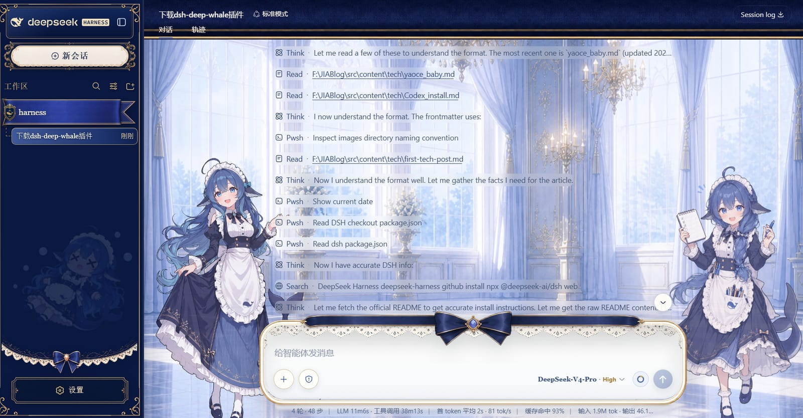

<blockquote style="border-left: 4px solid #4d6bfe; background-color: #f0f4ff; padding: 12px 16px; margin: 16px 0;">

**TL;DR**：DeepSeek Harness（简称 dsh）是 DeepSeek 官方开源的 agent 框架，一条 `npx @deepseek-ai/dsh web` 命令就能在浏览器里跑起来一个能读写文件、执行命令、拆任务的 AI 编程助手。本文记录从安装到上手的过程，并给它装了一套鲸鱼娘主题皮肤，最后聊聊使用感受。

</blockquote>

## 前言

最近网上刷到很多DeepSeek Harness分享体验和教程的视频，对于我经常vibecoding的用户来说高低尝试一下，DeepSeek 官方的 agent 框架 **DeepSeek Harness** 是用来在浏览器里跑 AI 编程助手，当然了网上也有大佬开源成桌面版的，但底层都是一样。它的设计挺有意思——「万物皆插件」，皮肤、工具、命令全都是插件，可以像搭积木一样往里装。装完后试一下插件功能，我给它上了个鲸鱼娘主题皮肤，界面好看很多，增加体验感。注意安装教程还是官网为准。

几个先放前面的链接，后面正文会反复用到：

- 官方仓库：[deepseek-ai/deepseek-harness](https://github.com/deepseek-ai/deepseek-harness)
- 鲸鱼娘皮肤：[Small-tailqwq/dsh-deep-whale](https://github.com/Small-tailqwq/dsh-deep-whale)
- DeepSeek 开放平台（申请 API Key）：[platform.deepseek.com](https://platform.deepseek.com/)

## 一、DeepSeek Harness 是什么

DeepSeek Harness 是 DeepSeek AI 开源的 agent 运行框架，几个关键点：

- **「万物皆插件」架构**：Everything is a plugin。web UI、工具、命令、皮肤……都是一个个插件，通过 profile 的 bundles 组合起来，装上/拆下都很灵活。
- **底层是 [Cordis](https://github.com/cordiverse/cordis)**：一个面向「时空可组合性」的插件框架，设计思路见它的 paper。
- **Web UI + CLI 双形态**：`dsh web` 打开浏览器界面，也有命令行模式。
- **还在 developer preview**：我装的时候版本是 `0.1.0-rc.7`，迭代很快，官方明确说了**会有破坏性变更**，命令和文档都可能变，建议跟着最新文档走最好。

## 二、安装 DeepSeek Harness

### 1. 装 Node.js

dsh 需要 Node.js 环境，推荐装 **LTS 版本**（长期支持版，最稳），Node 20 及以上都可以。

**Windows**：去官网下载 `.msi` 安装包，一路下一步即可：

- 官网（选 LTS）：[https://nodejs.org/zh-cn/download/](https://nodejs.org/zh-cn/download/)
- 国内镜像（下载更快）：[https://npmmirror.com/mirrors/node/](https://npmmirror.com/mirrors/node/)

**Ubuntu / Linux**：推荐用 nvm 管理（方便切换版本），或者直接下载二进制：

```bash
# nvm 安装（脚本拉不下来就挂代理，或换 gitee 镜像）
curl -o- https://raw.githubusercontent.com/nvm-sh/nvm/v0.40.1/install.sh | bash
# 重启终端后，安装并使用 LTS
nvm install --lts
nvm use --lts
```

装完验证一下，两个命令能打印出版本号就说明装好了：

```sh
node -v
npm -v
```

装好 Node.js 再继续下一步启动 Web UI。

### 2. 启动 Web UI

```sh
npx @deepseek-ai/dsh web
```

是启动也是安装，不知道是不是网络问题，我安装这个要20-30分钟，在终端等着就行。

也可以全局安装后再用：

```sh
npm i -g @deepseek-ai/dsh
dsh web
```

命令会启动服务并自动打开浏览器，默认地址是 `http://127.0.0.1:3080`。不想自动开浏览器就加 `--no-open`。

### 3. 配置模型

打开 **设置 → 模型（Settings → Models）**，填入 [DeepSeek API Key](https://platform.deepseek.com/)，保存。模型路由立刻生效，**不用重启服务**。

### 4. 选择工作区

点 **Choose workspace**，把启动 `dsh` 时所在的项目目录加进去并选中。没选工作区之前会话是灰的，选完就能发任务了。

### 5. 源码方式运行（可选）

想自己改源码、从仓库跑的话：

```sh
git clone https://github.com/deepseek-ai/deepseek-harness.git
cd deepseek-harness
pnpm install
pnpm run build
pnpm dsh web
```

## 三、安装鲸鱼娘皮肤插件

### 皮肤介绍

[dsh-deep-whale](https://github.com/Small-tailqwq/dsh-deep-whale) 是一个鲸鱼娘主题皮肤系列，里面两套：

| 皮肤 | 包名 | 说明 |
|---|---|---|
| 深海女仆工坊（maid-atelier） | `@dsh-external/dsh-client-ui-skin-maid-atelier` | 双女仆背景、深海蓝蕾丝界面与 Q 版侧栏 |
| 虎鲸链路（orca-link） | `@dsh-external/dsh-client-ui-skin-orca-link` | 珍珠白机械舱、黑曜虎鲸操作员与电蓝链路信号 |

两套都是 **CC BY-NC-SA 4.0**（署名-非商业性使用-相同方式共享），**禁止商用**。署名链要保留完整：一创「上善」鲸鱼娘角色 → 二创 ZipZipPipe / Small-tailqwq → 本皮肤。作者主页见文末链接。

### 安装步骤

```powershell
# 1. 克隆仓库
git clone https://github.com/Small-tailqwq/dsh-deep-whale

# 2. 注册皮肤（一定要用绝对路径，裸目录名会被当成 npm 包名去 registry 拉取，404 失败）
dsh plugin --profile web add C:/你的路径/dsh-deep-whale/maid-atelier

# 3. 确认注册成功（应看到 link: 依赖）
dsh plugin --profile web list

# 4. 核对组合配置
dsh --profile web --dump-config
```

注册后这是**新增插件包**，需要**重启 dsh** 才会加载；之后皮肤之间切换是热加载，不用重启。刷新页面即可看到皮肤。



也可以丢个链接直接让DeepSeek Harness帮你安装，省事很多。


## 四、使用感受

看上图，缓存命中率是真的高，国产模型也是好起来了，可惜涨价了。我使用起来和codex和claude的感觉差不多，还不错。

而且下载简单，只要一条 `npx` 命令就能在浏览器里用起来，不用像 Codex 那样配一堆代理和模型映射。插件化设计装皮肤、加工具都走 `dsh plugin`，配置用 patch 层覆盖、热重载，多数改动不用重启。

权限/沙箱这套机制第一次会有点懵——默认 `workspace-write` 只能动工作区目录，装插件要写 `~/.dsh` 就得升到 `danger-full-access`，不过想清楚之后反而觉得这种默认收紧挺安全。

鲸鱼娘皮肤加载后界面确实好看不少，双女仆背景加深海蓝蕾丝，热切换也方便。


## 相关链接

- [DeepSeek Harness 官方仓库](https://github.com/deepseek-ai/deepseek-harness)
- [Cordis 插件框架](https://github.com/cordiverse/cordis)
- [鲸鱼娘皮肤 dsh-deep-whale](https://github.com/Small-tailqwq/dsh-deep-whale)
- [DeepSeek 开放平台（API Key）](https://platform.deepseek.com/)
- [dsh-plugin 插件主题](https://github.com/topics/dsh-plugin)
- 皮肤署名：一创 [上善（Pixiv）](https://www.pixiv.net/users/62155430) · 二创 [ZipZipPipe（Pixiv）](https://www.pixiv.net/users/18604994)

## 小结

DeepSeek Harness 的「万物皆插件」设计让它很好扩展，一条命令起服务、浏览器里配好模型就能干活；配上鲸鱼娘皮肤，体验又上了一个台阶。目前还在 preview 阶段，适合尝鲜和折腾，正式用还是留意版本更新。

